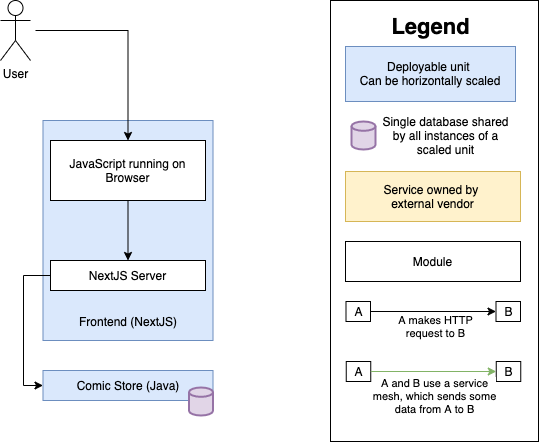

# IF Store


This repo contains a bunch of services which, together, run the IF Store comic book website.

## Architecture:


## Dependencies:
Although each service has its own dependencies (check the `README.md` files in the services for details), everything has been configured to run inside docker. So, the only dependency is:
- [Docker Compose](https://docs.docker.com/compose/install/), usually included in "Docker Desktop" for Windows and Mac, otherwise needs to be installed separately.

## To run:
From root directory of the repo, run: 
```bash
./run prod
```
or 
```bash
./run dev
```

This will run either development-mode, or prod-mode, in a docker container. The frontend service is accessible from a browser at http://localhost:3000.

## To test:
From root directory of the repo, run:
```bash
./run test
``` 

## To configure editor:
This is treated as a monorepo. A default configuration and some recommended extensions have been specified for the [VSCode](https://code.visualstudio.com/) code editor. To see the recommended extensions, open the root folder in VSCode, press `⌘+Shift+P` (or `Ctrl+Shift+P` on Windows), and execute the `Extensions: Show Recommended Extensions` command.
