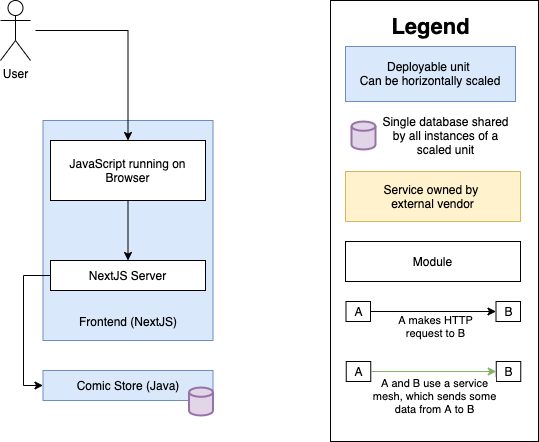

# IF Store


This repo contains a bunch of services which, together, run the IF Store comic book website.

## Architecture:



## Dependencies:

- [Docker Compose](https://docs.docker.com/compose/install/), usually included in "Docker Desktop" for Windows and Mac, otherwise needs to be installed separately.
- A running docker engine (start the docker desktop program)

## Helpful Commands:

A script will help you run or test the project.
To learn how to use the script, from the root directory of this repo, run:

```bash
./run
```

## To configure editor:

This is a monorepo. A default configuration and some recommended extensions have been specified for the [VSCode](https://code.visualstudio.com/) code editor.

To see the recommended extensions:

1. open the root folder in VSCode
2. press `⌘+Shift+P` (or `Ctrl+Shift+P` on Windows)
3. execute the `Extensions: Show Recommended Extensions` command.

## To add a new service to the architecture:

Just add a new directory in `./services/`, and make sure all the tests pass :)
